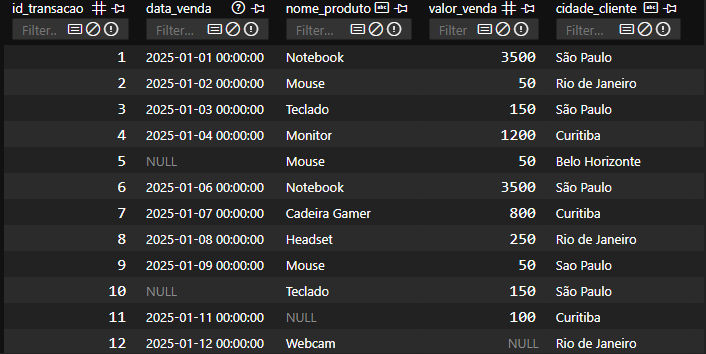

# 📊 Pipeline ETL de Vendas (Python + SQL)

## 📝 Sobre o Projeto

Este projeto simula um pipeline de Engenharia de Dados completo para uma empresa de E-commerce.
O objetivo foi resolver um problema comum de dados legados: receber arquivos CSV "sujos" (com erros de formatação, moedas misturadas e datas inconsistentes), limpar esses dados automaticamente e armazená-los em um Banco de Dados SQL pronto para análise.

**Problema de Negócio:**
O time de vendas enviava planilhas com:

- Valores monetários como texto (ex: "R$ 1.200,50")
- Datas em formatos mistos (BR e ISO)
- Registros duplicados
- Campos nulos

**Solução:**
Um script Python automatizado que realiza o processo ETL (Extract, Transform, Load).

---

## 🛠 Tecnologias Utilizadas

- **Python 3.12**
- **Pandas** (Tratamento e limpeza de dados)
- **SQLite** (Banco de dados relacional)
- **Git/GitHub** (Versionamento)

---

## ⚙️ Funcionalidades do Pipeline

1.  **Extract:** Leitura de arquivos CSV brutos.
2.  **Transform:**
    - Sanitização de valores monetários (Conversão String -> Float).
    - Padronização de datas (Tratamento de formatos mistos BR/US).
    - Remoção de duplicatas (Deduplicação de linhas).
    - Tratamento de valores nulos (`NaN` e `NaT`).
3.  **Load:** Persistência dos dados tratados em tabela SQL (`vendas_tratadas`).

---

## 🚀 Como Rodar o Projeto

### Pré-requisitos

- Python instalado
- Git instalado

### Passo a Passo

```bash
# 1. Clone o repositório
git clone [https://github.com/KelvinSousaDev/Projeto-ETL-Vendas.git](https://github.com/KelvinSousaDev/Projeto-ETL-Vendas.git)

# 2. Entre na pasta
cd Projeto-ETL-Vendas

# 3. Crie e ative o ambiente virtual (Windows)
python -m venv venv
.\venv\Scripts\activate

# 4. Instale as dependências
pip install -r requirements.txt

# 5. Execute o gerador de dados (para simular o CSV sujo)
python gerar_csv_sujo.py

# 6. Execute o Pipeline ETL
python etl_pipeline.py

```

# 📊 Resultados (Antes e Depois)

**Antes (CSV Sujo):**


**Depois (SQL Limpo):**



## Autor

Feito por **Kelvin Sousa** durante sua jornada para Engenharia de Dados.
[LinkedIn](https://www.linkedin.com/in/okelvinsousa)
